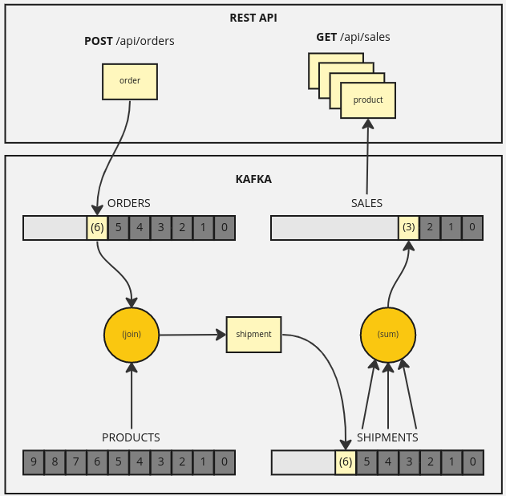

# Kafka streams basic service example

* [Introduction](#introduction)
* [Domain context](#domain-context)
* [Achitecture and flow](#architecture)
* [Running the application](#running-app)
* [Playing with API](#playing-with-api)
* [Running tests](#running-tests)

### <a name="introduction"></a>Introduction

This is an example Spring Boot application showing how you can use Kafka 
as a streaming platform by performing combination and aggregation of data from 
different topics and then allowing to query Kafka topic to get aggregated data,
eliminating this way requirement for using standard database.


### <a name="domain-context"></a>Domain context
Application uses very simple flow of online shop order processing, where user
places an order for some item. Then a shipment for this order is created and
based on created shipments aggregated sales data for each product is created.

### <a name="architecture"></a>Architecture and flow

There are 2 simple layers in this example:
* `REST API` layer used to create and order and to query aggregated sales data
* `KAFKA` layer used to accept orders, process them, store and expose aggregated 
sales data

`KAFKA` layer operates on 4 topics:
1. `ORDERS` - created orders are published to this topic;
2. `PRODUCTS` - [compacted](https://developer.confluent.io/learn-kafka/architecture/compaction/) topic acting as products dictionary (consider it as a
   stock); it is populated with 10 initial products upon application startup;
3. `SHIPMENTS` - contains shipments which are combination of data from `ORDERS`
   and `PRODUCTS` topic
4. `SALES` - [compacted](https://developer.confluent.io/learn-kafka/architecture/compaction/)  topic containing aggregated sales data with the information 
about total quantities of shipped products



Flow of the application is as follows:
1. `order` is created upon `POST` request to `/api/orders`;<br>
**example request body**:
```json
{
  "id": "92e53384-a15d-48f2-9afc-5cfaafd9649f",
  "item": {
    "id": "1",
    "quantity": 1
  },
  "recipient": {
    "firstName": "John",
    "lastName": "Doe"
  }
}
```
2. `order` and `product` are joined by `order.id = product.id` and `shipment` is
published to `SHIPMENTS` topic;<br>
**example `shipment`**:
```json
{
  "id": "92e53384-a15d-48f2-9afc-5cfaafd9649f",
  "product": {
    "id": "1",
    "name": "APPLE iPhone 12 64GB 5G",
    "orderedQuantity": 1
  },
  "recipient": {
    "firstName": "John",
    "lastName": "Doe"
  }
}
```
3. products contained in shipments are aggregated and total quantity of
shipped products is calculated by summing quantity from each shipment;<br>
**example result**:
```json
{
  "id": "1",
  "name": "APPLE iPhone 12 64GB 5G",
  "orderedQuantity": 20703
}
```
4. retrieve sales data by querying `GET /api/sales`;<br>
**example response**:
```json
[
    {
        "id": "1",
        "name": "APPLE iPhone 12 64GB 5G",
        "orderedQuantity": 20703
    },
    {
        "id": "2",
        "name": "SAMSUNG 55'' QLED 4K Tizen TV",
        "orderedQuantity": 300
    }
]
```
### <a name="running-app"></a>Running the application

In order to run the application you need:
* JDK 17,
* Docker and be able to run `docker-compose`,
* Maven.

Go to the application source root directory and first start Kafka (`-d` to start it
in background):
```shell
> docker-compose up -d
```
then start the application:
```shell
> mvn spring-boot:run
```
Launched services are available by default at:
* Kafka: `localhost:9092`
* application: `localhost:8080`

You can use whatever client you want to connect to Kafka and browse created 
topics at any time.

After the application had successfully started you can start using the REST API.

### <a name="playing-with-api"></a>Playing with API

To place an order run, for example:
```shell
curl --location --request POST 'localhost:8080/api/orders' \
--header 'Content-Type: application/json' \
--data-raw '{
    "item": {
        "id": "1",
        "quantity": 1
    },
    "recipient": {
        "firstName": "John",
        "lastName": "Doe"
    }
}'
```
To get sales data run:
```shell
curl --location --request GET 'localhost:8080/api/sales'
```
### <a name="running-tests"></a>Running tests

You can also launch tests by running from application source root directory:
```shell
> mvn verify
```
